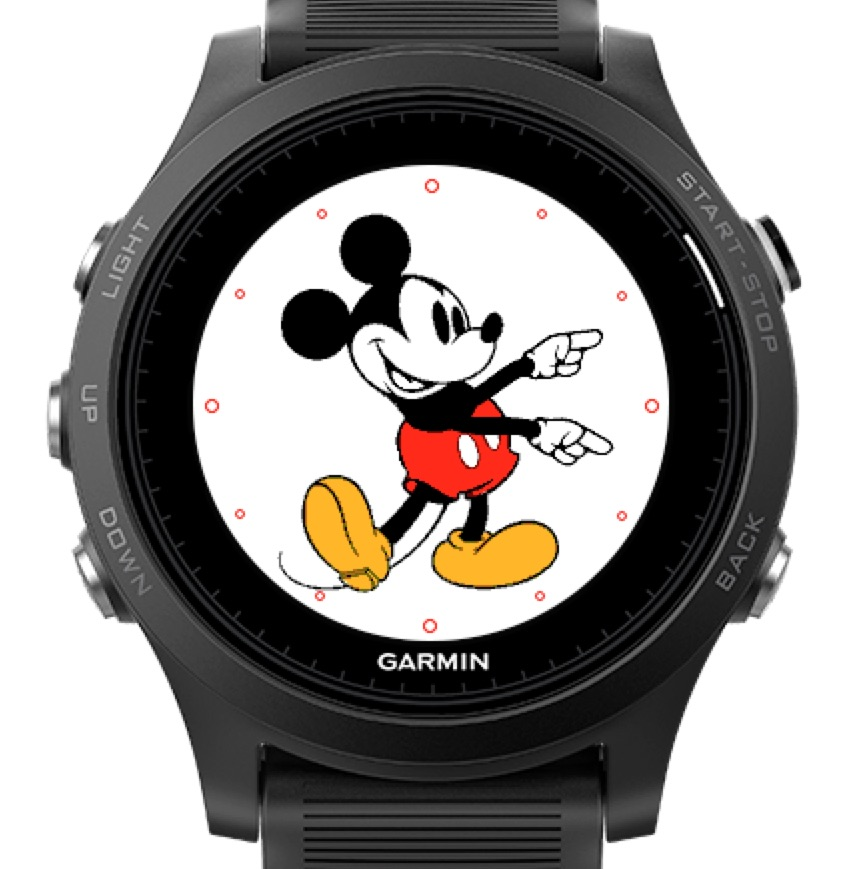

# Mickey

An Mickey watchface for Garmin's wearable lineup.

## About

The purpose of this code is to showcase a new rendering technique I developed using fonts as a tilemap.
This is a more storage-friendly method than images, and allows developers to efficiently pack many frames of bitmapped animation in a 26kb font.
Also, the great thing about fonts, its that they do alpha blending with the existing framebuffer on the canvas. So, you get anti-aliasing as a nice by-product.
